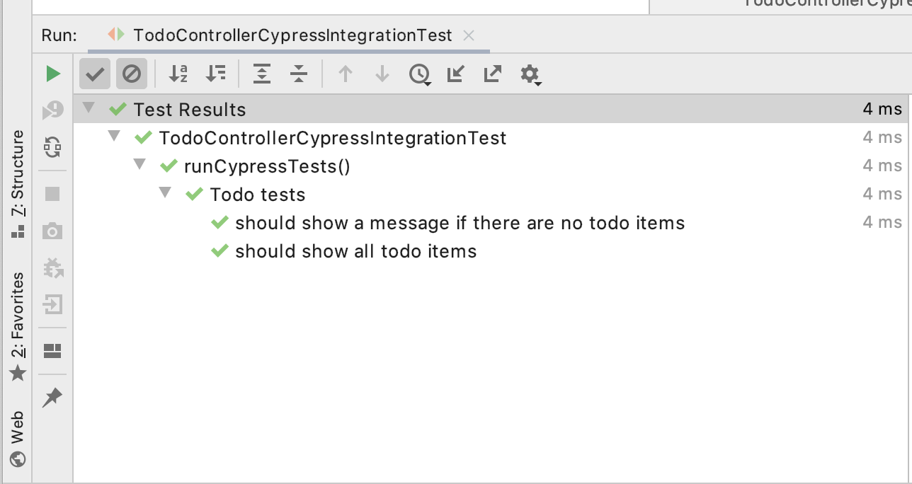

= Cypress Testcontainer
:toc: macro

image:https://travis-ci.org/wimdeblauwe/testcontainers-cypress.svg?branch=master["Build Status", link="https://travis-ci.org/wimdeblauwe/testcontainers-cypress"]
image:https://sonarcloud.io/api/project_badges/measure?project=io.github.wimdeblauwe%3Atestcontainers-cypress&metric=coverage["Coverage", link="https://sonarcloud.io/dashboard?id=io.github.wimdeblauwe%3Atestcontainers-cypress"]
image:https://maven-badges.herokuapp.com/maven-central/io.github.wimdeblauwe/testcontainers-cypress/badge.svg["Maven Central", link="https://search.maven.org/search?q=a:testcontainers-cypress"]

toc::[]

== Goal

The goal of this project is to make it easy to start https://www.cypress.io/[Cypress] tests via https://www.testcontainers.org/[Testcontainers].

== Example usage

=== Setup Cypress

. Create `src/test/e2e` directory in your project.
. Run `npm init` in that directory. This will generate a `package.json` file.
. Run `npm install cypress --save-dev` to install Cypress as a development dependency.
. Run `npx cypress open` to start the Cypress application. It will notice that this is the first startup and add some example tests.
. Run `npm install cypress-multi-reporters mocha mochawesome --save-dev` to install Mochawesome as a test reporter. Testcontainers-cypress will
use that to parse the results of the Cypress tests.
. Update `cypress.json` as follows:
+
[source,json]
----
{
  "baseUrl": "http://localhost:8080",
  "reporter": "cypress-multi-reporters",
  "reporterOptions": {
    "configFile": "reporter-config.json"
  }
}
----
. Create a `reporter-config.json` file (next to `cypress.json`) and ensure it contains:
+
[source,json]
----
{
  "reporterEnabled": "spec, mochawesome",
  "mochawesomeReporterOptions": {
    "reportDir": "cypress/reports/mochawesome",
    "overwrite": false,
    "html": false,
    "json": true
  }
}
----

[TIP]
====
Add the following to your `.gitignore` to avoid accidental commits:

[source]
----
node_modules
src/test/e2e/cypress/reports
src/test/e2e/cypress/videos
src/test/e2e/cypress/screenshots
----
====

=== Add dependency

==== Maven

Use this dependency if you use Maven:

[source,xml]
----
<dependency>
    <groupId>io.github.wimdeblauwe</groupId>
    <artifactId>testcontainers-cypress</artifactId>
    <version>${tc-cypress.version}</version>
    <scope>test</scope>
</dependency>
----

Add `src/test/e2e` as a test resource directory:

[source,xml]
----
<project>
    <build>
        ...
        <testResources>
            <testResource>
                <directory>src/test/resources</directory>
            </testResource>
            <testResource>
                <directory>src/test/e2e</directory>
                <targetPath>e2e</targetPath>
            </testResource>
        </testResources>
    </build>
</project>
----

==== Gradle

For Gradle, use the following dependency:

[source, groovy]
----
testImplementation 'io.github.wimdeblauwe:testcontainers-cypress:${tc-cypress.version}'
----

Add `src/test/e2e` as a test resource directory:

_TODO add instructions on how to do this in Gradle (PR welcome)._

=== Usage with a @SpringBootTest

The library is not tied to Spring Boot, but I will use the example of a `@SpringBootTest`
to explain how to use it.

Suppose you have a Spring Boot application that has server-side rendered templates using Thymeleaf, and
you want to write some UI tests using Cypress. We want to drive all this from a JUnit based test, so we do the following:

. Have Spring Boot start the complete application in a test. This is easy using the `@SpringBootTest` annotation on a JUnit test.
. Expose the web port that was opened towards Testcontainers so that Cypress that is running in a Docker container can access
our started web application.
. Start the Docker container to run the Cypress tests.
. Wait for the tests to be done and report the results to JUnit.

Start by writing the following JUnit test:

[source,java]
----
@SpringBootTest(webEnvironment = SpringBootTest.WebEnvironment.RANDOM_PORT) //<.>
@AutoConfigureTestDatabase(replace = AutoConfigureTestDatabase.Replace.NONE) //<.>
public class CypressEndToEndTests {

    @LocalServerPort //<.>
    private int port;

     @Test
    void runCypressTests() throws InterruptedException, IOException, TimeoutException {

        Testcontainers.exposeHostPorts(port); //<.>

        try (CypressContainer container = new CypressContainer().withLocalServerPort(port)) { //<.>
            container.start();
            CypressTestResults testResults = container.getTestResults(); //<.>

            if (testResults.getNumberOfFailingTests() > 0) {
                fail("There was a failure running the Cypress tests!\n\n" + testResults); //<.>
            }
        }
    }
}
----
<.> Have Spring Boot start the full application on a random port.
<.> Tell Spring Boot to _not_ configure a test database,  Because we use a real database (via Testcontainers obviously :-) ).
<.> Have Spring inject the random port that was used when starting the application.
<.> Ensures that the container will be able to access the Spring Boot application that is started via @SpringBootTest
<.> Create the `CypressContainer` and pass in the `port` so the base URL that Cypress will use is correct.
<.> Wait on the tests and get the results.
<.> Check if there have been failures in Cypress. If so, fail the test.

=== JUnit 5 dynamic tests

If you are using JUnit 5, then you can use a `@TestFactory` annotated method so that it looks like there is a JUnit test
for each of the Cypress tests.

[source,java]
----
@SpringBootTest(webEnvironment = SpringBootTest.WebEnvironment.RANDOM_PORT)
@AutoConfigureTestDatabase(replace = AutoConfigureTestDatabase.Replace.NONE)
public class CypressEndToEndTests {

    @LocalServerPort
    private int port;

     @TestFactory // <.>
    void runCypressTests() throws InterruptedException, IOException, TimeoutException {

        Testcontainers.exposeHostPorts(port);

        try (CypressContainer container = new CypressContainer().withLocalServerPort(port)) {
            container.start();
            CypressTestResults testResults = container.getTestResults();

             return convertToJUnitDynamicTests(testResults); // <.>
        }
    }

    @NotNull
    private List<DynamicContainer> convertToJUnitDynamicTests(CypressTestResults testResults) {
        List<DynamicContainer> dynamicContainers = new ArrayList<>();
        List<CypressTestSuite> suites = testResults.getSuites();
        for (CypressTestSuite suite : suites) {
            createContainerFromSuite(dynamicContainers, suite);
        }
        return dynamicContainers;
    }

    private void createContainerFromSuite(List<DynamicContainer> dynamicContainers, CypressTestSuite suite) {
        List<DynamicTest> dynamicTests = new ArrayList<>();
        for (CypressTest test : suite.getTests()) {
            dynamicTests.add(DynamicTest.dynamicTest(test.getDescription(), () -> assertTrue(test.isSuccess())));
        }
        dynamicContainers.add(DynamicContainer.dynamicContainer(suite.getTitle(), dynamicTests));
    }
}
----
<.> Use the `@TestFactory` annotated as opposed to the `@Test` method
<.> Use the `CypressTestResults` to generate `DynamicTest` and `DynamicContainer` instances

If the Cypress tests look like this:

[source,javascript]
----
context('Todo tests', () => {
   it('should show a message if there are no todo items', () => {
       cy.request('POST', '/api/integration-test/clear-all-todos');
       cy.visit('/todos');
       cy.get('h1').contains('TODO list');
       cy.get('#empty-todos-message').contains('There are no todo items');
   });

   it('should show all todo items', () => {
       cy.request('POST', '/api/integration-test/prepare-todo-list-items');
       cy.visit('/todos');
       cy.get('h1').contains('TODO list');
       cy.get('#todo-items-list')
           .children()
           .should('have.length', 2)
           .should('contain', 'Add Cypress tests')
           .and('contain', 'Write blog post');
   })
});
----

Then running the JUnit test will show this in the IDE:

This makes it a lot easier to see which Cypress test has failed.

== Configuration options

The `CypressContainer` instance can be customized with the following options:

[cols="m,a,m"]
|===
|Method |Description |Default

|CypressContainer(String dockerImageName)
|Allows to specify the docker image to use
|cypress/included:4.0.1

|withLocalServerPort(int port)
|Set the port where the server is running on. It will use http://host.testcontainers.internal as hostname with the given port as the Cypress base URL. For a `@SpringBootTest`, pass the injected `@LocalServerPort` here.
|8080

|withBaseUrl(String baseUrl)
|Set the full server url that will be used as base URL for Cypress.
|http://host.testcontainers.internal:8080

|withBrowser(String browser)
|Set the browser to use when running the tests (E.g. `electron`, `chrome`, `firefox`)
|electron

|withSpec(String spec)
|Sets the test(s) to run. This can be a single test (e.g. `cypress/integration/todos.spec.js`)
or multiple (e.g. `cypress/integration/login/**`)
| By default (meaning not calling this method), all tests are run.

|withClasspathResourcePath(String resourcePath)
|Set the relative path of where the cypress tests are (the path is the location of where the `cypress.json` file is)
|e2e

|withMaximumTotalTestDuration(Duration duration)
|Set the maximum timeout for running the Cypress tests.
|Duration.ofMinutes(10)

|withGatherTestResultsStrategy(GatherTestResultsStrategy strategy)
|Set the `GatherTestResultsStrategy` object that should be used for gathering information on the Cypress tests results.
|MochawesomeGatherTestResultsStrategy

|withMochawesomeReportsAt(Path path)
|Set the path (relative to the root of the project) where the Mochawesome reports are put.
|FileSystems.getDefault().getPath("target", "test-classes", "e2e", "cypress", "reports", "mochawesome")

|withAutoCleanReports(boolean autoCleanReports)
|Set if the Cypress test reports should be automatically cleaned before each run or not.
|true
|===

== Testcontainers & Cypress versions compatibility

|===
|Testcontainers-cypress |Testcontainers | Cypress

|https://github.com/wimdeblauwe/testcontainers-cypress/releases/tag/testcontainers-cypress-1.0.0[1.0.0]
|https://github.com/testcontainers/testcontainers-java/releases/tag/1.14.3[1.14.3]
|https://docs.cypress.io/guides/references/changelog.html#4-5-0[4.12.1]

|https://github.com/wimdeblauwe/testcontainers-cypress/releases/tag/testcontainers-cypress-0.7.0[0.7.0]
|https://github.com/testcontainers/testcontainers-java/releases/tag/1.14.1[1.14.1]
|https://docs.cypress.io/guides/references/changelog.html#4-5-0[4.5.0]

|https://github.com/wimdeblauwe/testcontainers-cypress/releases/tag/testcontainers-cypress-0.6.0[0.6.0]
|https://github.com/testcontainers/testcontainers-java/releases/tag/1.13.0[1.13.0]
|https://docs.cypress.io/guides/references/changelog.html#4-3-0[4.3.0]

|https://github.com/wimdeblauwe/testcontainers-cypress/releases/tag/testcontainers-cypress-0.5.0[0.5.0]
|https://github.com/testcontainers/testcontainers-java/releases/tag/1.12.5[1.12.5]
|https://docs.cypress.io/guides/references/changelog.html#4-0-2[4.0.2]

|https://github.com/wimdeblauwe/testcontainers-cypress/releases/tag/testcontainers-cypress-0.4.0[0.4.0]
|https://github.com/testcontainers/testcontainers-java/releases/tag/1.12.5[1.12.5]
|https://docs.cypress.io/guides/references/changelog.html#4-0-1[4.0.1]

|https://github.com/wimdeblauwe/testcontainers-cypress/releases/tag/testcontainers-cypress-0.3.0[0.3.0]
|https://github.com/testcontainers/testcontainers-java/releases/tag/1.12.3[1.12.3]
|https://docs.cypress.io/guides/references/changelog.html#3-8-3[3.8.3]

|https://github.com/wimdeblauwe/testcontainers-cypress/releases/tag/testcontainers-cypress-0.2.0[0.2.0]
|https://github.com/testcontainers/testcontainers-java/releases/tag/1.12.3[1.12.3]
|https://docs.cypress.io/guides/references/changelog.html#3-8-1[3.8.1]

|https://github.com/wimdeblauwe/testcontainers-cypress/releases/tag/testcontainers-cypress-0.1.0[0.1.0]
|https://github.com/testcontainers/testcontainers-java/releases/tag/1.12.3[1.12.3]
|https://docs.cypress.io/guides/references/changelog.html#3-8-0[3.8.0]
|===

== Links

Links to blog or articles that cover testcontainers-cypress:

https://www.wimdeblauwe.com/blog/2020/2020-02-01-example-usage-of-testcontainers-cypress/[Example usage of testcontainers cypress] :: Good introduction on how to get started.
https://www.wimdeblauwe.com/blog/2020/2020-02-11-testcontainers-cypress-release-0.4.0/[Testcontainers-cypress release 0.4.0] :: Shows how to run tests on multiple browsers with JUnit

== Development

* Builds are done on Travis: https://travis-ci.org/wimdeblauwe/testcontainers-cypress
* Code quality is available via SonarQube: https://sonarcloud.io/dashboard?id=io.github.wimdeblauwe%3Atestcontainers-cypress

== Deployment

* SNAPSHOT versions are put on https://oss.sonatype.org/content/repositories/snapshots
* All releases can be downloaded from https://oss.sonatype.org/content/groups/public

== Release

Release is done via the Maven Release Plugin:

`mvn release:prepare`

and

`mvn release:perform`

Finally, push the local commits and the tag to remote.

[NOTE]
====
Before releasing, run `export GPG_TTY=$(tty)`
====
